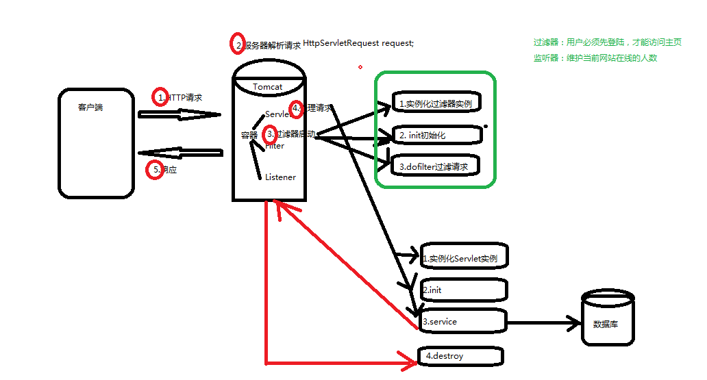

# 今日概要
	一、JSTL(JSP标准的标签库)	
	二、Filter和Listener

# 一、JSTL
### <1>概念
	JSP Standard Tag Library ,JSP标准的标签库

### <2>作用
	1.有助于前端开发人员的作业
	2.将数据和显示分类
	3.将业务封装到JSTL中，可以重用
		
### <3>语法
	1. 下载JSTL的jar包，添加到项目中（lib文件下）
	2. 在使用此标签库的页面中添加taglib指令
	   <%@taglib uri="标签库的描述" prefix="前缀"%>
	
		uri:用来匹配引入的标签库文件
		prefix:前缀，区分不同库中的标签

### <4>常用的标签
	<if>：判断标签
		语法格式：
		<c:if test="条件表达式">
			分支语句	
		</c:if>	
			
		属性：test属性是必要写的属性，boolean类型

	
	<choose>：多分支判断
		语法格式：
		<c:choose>
			<c:when test="条件">分支语句</c:when>			
			...
			<c:otherwise>分支语句</c:otherwise>
		</choose>
			
		属性：test属性，是分支结构的入口，boolean类型	

	    例如：
		<c:choose>
		<c:when test="${param.num==1}">
			
		</c:when>
		<c:when test="${param.num==2}">
			
		</c:when>
		<c:when test="${param.num==3}">
			
		</c:when>
		<c:otherwise>
			
		</c:otherwise>
	</c:choose>

	<foreach>：循环标签
		语法格式：
		<c:foreach item="" var="object">
			//循环体
					
		</c:foreach>			
					
		属性：item表示数据源，var从数据源中获取的一个对象

### <5>自定义标签（了解）
	编写的步骤：
		1.编写一个tld文件，描述一个自定义的标签库	

		2.编写一个类，实现标签的功能

		3.导入自己编写的标签库
			
		
# 二、Filter过滤器
### <1>概念
	web服务器上的所有对资源的请求进行管理和过滤操作

	Filter对用户的请求进行预处理，然后接着将请求提交给Servlet进行处理和响应，最后Filter对服务器的响应进行处理。

	
### <2>特点
	保证资源的安全性
	身份的验证
	编码的设置
	... ...

### <3>实现的流程
	1. 编写一个类，实现Filter接口，重写过滤方法
	2. 在web.xml中配置过滤器，指定过滤资源

	<!-- 配置过滤器对象 -->
	<filter>
		<filter-name>checklogin</filter-name>
		<filter-class>cn.xdl.filter.MyFilter</filter-class>
	</filter>

	<!-- 指定需要拦截的请求 -->
	<filter-mapping>
		<filter-name>checklogin</filter-name>
		<url-pattern>/product_list.jsp</url-pattern>
	</filter-mapping>
								
	
Java WEB项目制作过程中，在web.xml中巧用Listener可以实现一些特定的需求，可以监听 Web应用事件，能最大程度地控制你的Web应用，这里介绍两个比较重要的 WEB应用事件：

应用启动事件发生在你的应用第一次被servlet容器装载和启动的时候；停止事件发生在Web应用停止的时候。 

Session创建事件发生在每次一个新的session创建的时候，类似地Session失效事件发生在每次一个Session失效的时候。为了使用这些Web应用事件为你做些有用的事情，我们必须创建和使用一些特殊的“监听”类。监听类，它们就是实现了下边两个接口中任何一个接口的简单的java类：
		
		javax.servlet.ServletContextListener
		javax.servlet.http.HttpSessionListener  

如果你想让你的类监听应用的启动和停止事件，你就得实现ServletContextListener接口;

如果你想让你的类去监听Session的创建和失效事件，那你就得实现HttpSessionListener接口。 

让我们看看在这些接口中你必须要实现的方法。

* 1、监听应用的启动和停止 ServletContextListener ：

接口包括如下两个方法：

		public void contextInitialized(ServletContextEvent sce); 
		public void contextDestroyed(ServletContextEvent sce); 

如果你实现了一个接口，那你就必须实现它所有的方法。因此，如果你想利用应用的启动和停止事件，你就需要创建一个Java类并实现ServletContextListener接口。下边是这样的一个类的例子：

		import javax.servlet.ServletContextListener;
		import javax.servlet.ServletContextEvent;
		public class ApplicationWatch implements ServletContextListener {
		public static long applicationInitialized = 0L;
		/* 应用启动事件 */
		public void contextInitialized(ServletContextEvent ce) {
		applicationInitialized = System.currentTimeMillis();
		//这里还可以添加你需要的业务处理
		}
		/*应用停止事件 */
		public void contextDestroyed(ServletContextEvent ce) {}
		}

在上边的代码中，ApplicationWatch类实现了ServletContextListener接口。它实现了接口中的两个方法，但只用了其中的一个方法，另一个方法中没有写任何代码。这个类把应用启动的时间记录在一个可以从其它应用类中存取应用启动时间的public static变量中，当然你也可以根据系统的需要在contextInitialized方法中添加一些自己的业务处理，以达到系统启动即加载的需求。
 
* 2、Session的创建和失效HttpSessionListener：

首先让我们看看HttpSessionListener接口有什么不同的方法，这个接口也只包含两个方法，分别对应于Session的创建和失效：

		· public void sessionCreated(HttpSessionEvent se); 
		· public void sessionDestroyed(HttpSessionEvent se);

如上边的ApplicationWatch例子那样，我们也创建了一个实现HttpSessionListener接口的类。如下：

		import javax.servlet.http.HttpSessionListener;
		import javax.servlet.http.HttpSessionEvent;
		public class SessionCounter implements HttpSessionListener {
		private static int activeSessions =0;
		/* Session创建事件 */
		public void sessionCreated(HttpSessionEvent se) {
		       activeSessions++;
		}
		/* Session失效事件 */
		public void sessionDestroyed(HttpSessionEvent se) {
		if(activeSessions>0)activeSessions--;
		}

		public static int getActiveSessions() {
		return activeSessions;
		    }
		}

在上边的代码中，SessionCounter类实现了HttpSessionListener接口，其目的是计算活动会话的数量。

以上两个监听类写好后，还需要告诉应用服务器有这些监听类，这就需要在web.xml文件中声明，下面我们看看web.xml的配置。

* Web.xml 配置:
   
   我们通过把类路径加入/WEB-INF/web.xml文件的标签<listener>中来告诉服务器我们的监听类。下边是一个web.xml文件的例子：

		<!-- Web.xml -->
		<?xml version="1.0" encoding="ISO-8859-1"?>
		<!DOCTYPE web-appPUBLIC "-//Sun Microsystems, Inc.//DTD Web Application 2.3//EN""http://java.sun.com/j2ee/dtds/web-app_2.3.dtd">
		<web-app>
		<!-- Listeners -->
		<listener>
			<listener-class>
				com.stardeveloper.web.listener.SessionCounter
			</listener-class>
		</listener>
		<listener>
			<listener-class>
				com.stardeveloper.web.listener.ApplicationWatch</listener-class>
			</listener>
		</web-app>

如上所示，在web.xml文件中声明监听类是非常简单的。现在，每次的服务器的启动和停止，会话的创建和失效，配置好的监听类的相应的方法就会被调用。就这么简单！

